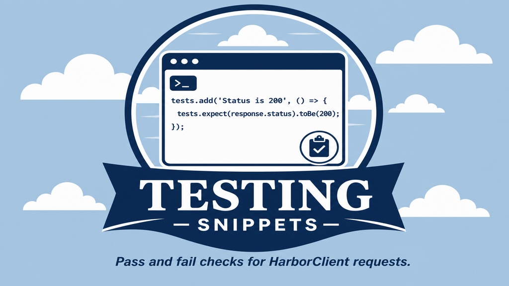

# Testing Snippets

HarborClient snippet bundle with pass and fail post-request tests.



## Snippets

Both snippets run in **post-request** script lists (collection or request **PostRequest** tab).

| Snippet  | Purpose                                                                         |
| -------- | ------------------------------------------------------------------------------- |
| **Pass** | Asserts a successful response. Use against endpoints that are meant to succeed. |
| **Fail** | Asserts a error response (expects `400`). Use against endpoints meant to fail.  |

## Install

Requires HarborClient **2.0.0** or later.

1. Open **File → Snippets**.
2. Browse the **Marketplace** tab and install **Testing**, or use **Install** with this repository URL:
   `https://github.com/harborclient/snippet-testing`
3. Installed snippets appear under **Settings → Snippets** and can be referenced from any post-request script list via **Select snippet...**.

See [Testing](https://harborclient.github.io/testing) and [Request scripts — Snippets](https://harborclient.github.io/request-scripts#snippets) in the HarborClient docs for more on writing and using tests.

## Development

```bash
pnpm install
```

Sign the bundle directory with an Ed25519 key:

```bash
export HARBORCLIENT_PLUGIN_SIGNING_KEY=/path/to/signing.pem
pnpm sign
```

Publish a new version (bumps `snippets.json`, signs, commits, tags, and pushes):

```bash
pnpm release
pnpm release -- --version minor
```

See the [@harborclient/sdk signing docs](https://harborclient.github.io/sdk/signing) for key generation and `signature.json` format.
